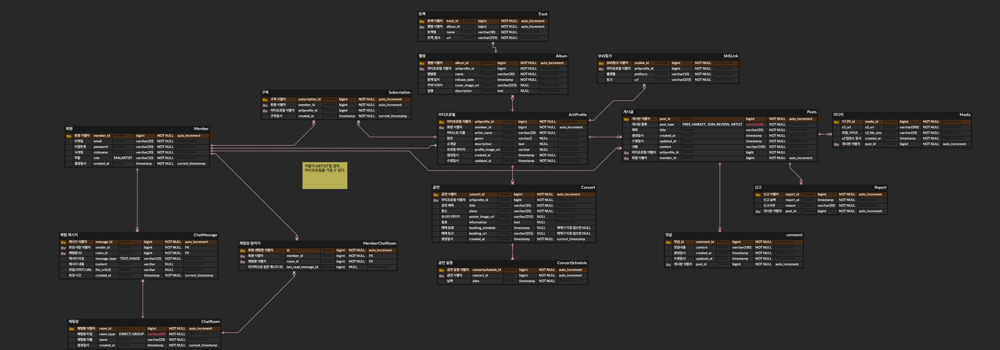

# BandChu API Server

[](https://kotlinlang.org/docs/whatsnew2221.html)
[](https://spring.io/projects/spring-boot)
[](https://github.com/JetBrains/Exposed)
[](https://www.postgresql.org/)
[](https://kotest.io/)
[](https://gradle.org/)

<br>

## 📄 공유 문서

- [API 명세](./docs/API_SPEC.md)
- [협업 가이드](./docs/TEAM_GUIDE.md)

<br>

## 📂 디렉토리 구조

```
   api
    ├── domain
    │   ├── member
    │   └── post
    │       ├── dto
    │       ├── controller
    │       ├── service
    │       ├── repository
    │       └── model
    ├── global
    │   ├── config
    │   ├── exception
    │   ├── response
    │   └── ...
    └── ApiApplication
```

<br>

## 📚 데이터베이스 스키마



<br>

## ⚙️ 환경 변수 설정

```properties
# 데이터베이스 설정
DB_URL=jdbc:postgresql://localhost:5432/bandchu
DB_USERNAME=your_db_username
DB_PASSWORD=your_db_password

# Google OAuth 설정
GOOGLE_CLIENT_ID=your_google_client_id

# AWS Credential 설정
AWS_CREDENTIAL_ACCESS_KEY=your_aws_access_key
AWS_CREDENTIAL_SECRET_KEY=your_aws_secret_key
```
- **DB_URL**: PostgreSQL 데이터베이스 연결 URL
- **DB_USERNAME**: 데이터베이스 사용자 이름
- **DB_PASSWORD**: 데이터베이스 비밀번호
- **GOOGLE_CLIENT_ID**: Google OAuth 2.0 클라이언트 ID (Google Cloud Console에서 발급)
- **AWS_CREDENTIAL_ACCESS_KEY / SECRET_KEY**: AWS S3 접근을 위한 IAM 사용자 키

<!--
<br>

## 🛠️ Server Architecture
-->
